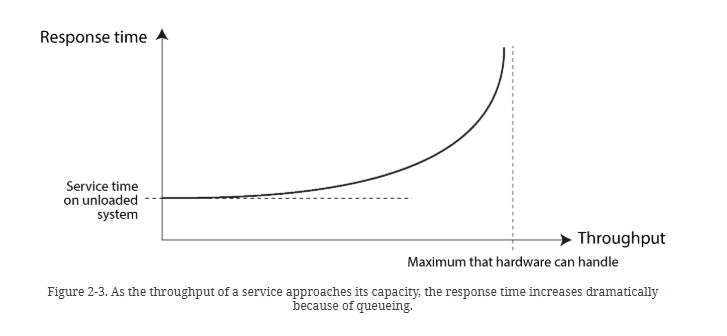
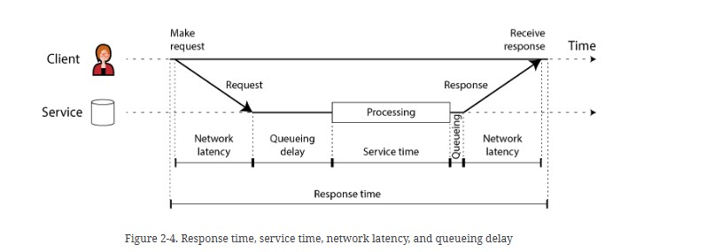
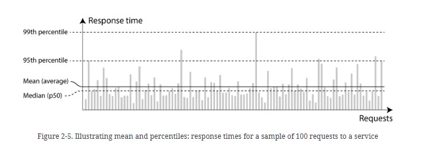
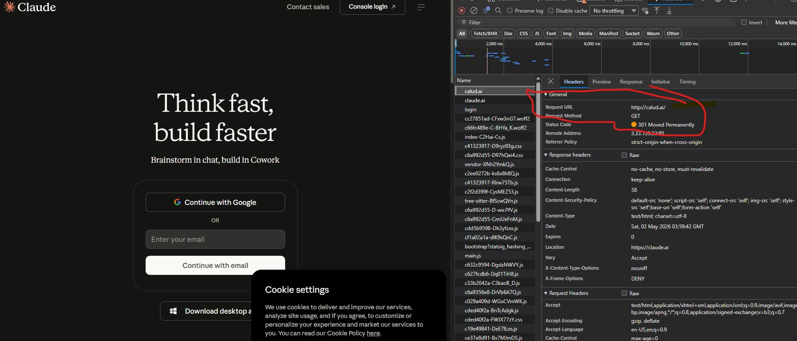

# Chapter 2 - Defining Nonfunctional Requirements

## Case-Study

## Performance

### Metrics to describe performance

#### Recovery of Overloaded System
- How tenous is it to recover an overloaded system / how often do system or parts of system crashes in production environment?

### Response Times Components

- Do you folks largely use traces to calculate these time, and how do folks generally do that under different load conditions / different hardware size?

## Reliability and Fault Tolerance

* In-General Correctness
* Correctness in the wake of common user mistakes
(Just try typing in different variations of google.com and your browser will be redirected to google.com or variation of other popular sites, try out faceboo.com / calud.ai)

* Good enough performance, under expected load and data volume

* No unauthorized access / abuse

### Fault Tolerance

* distinction between fault vs failure

* fault injection / chaos engineering 

* Hardware corruption

* Post Office scandal story 

- Have any of you guys worked out / tested your systems with faults? Can any of you folks share stories of some debugging sessions / fault stories?

## Scalability

* System's ability to cope with increased load (measured in different ways)

* Ways of measuring loads:

    - In terms of increased users (averages / bursts)
    - In terms of increased data volumes

* Different Architectures

    - Shared Memory (in the context of different threads)
    - Shared Disk (in the context of different machines)
    - Shared Nothing 

### Scalability Principles

* Breaking a system into smaller components that can operate independently from each other
* Keeping things simple, a single instance system is better than a complicated distributed setup
* Manually scaled system can be simpler, easier to manage rather than autoscaling systems.

## Maintainability

### Operability

* Monitoring Tools
* No single machine dependency
* Good documentation, good default and predictable behavior 

### Simplicity & Evolvability

* Effectively applying HLD & LLD principles, OOP, SOLID principles

---------------------------------------------------------------------------------

Ways to think about non-functional requirements:

1. CAP theorem
2. Environmental Constraints - user conditions
3. Scalability - Bursty traffic / read-write loads
4. Latency - Variable latency across different systems
5. Durability - data loss
6. Security - secure across different contexts (safety of user / safety against prompt injection / system threats)
7. Fault Tolerance
8. Compliance

------------------------------------------------------------------------------------
## Writing down NFR

### System 1 (Dating App)

* Users can create a profile with preferences (e.g. age range, interests) and specify a maximum distance.

* Users can view a stack of potential matches in line with their preferences and within max distance of their current location.

* Users can swipe right / left on profiles one-by-one, to express 'yes' or 'no' on other users.

* Users get a match notification if they mutually swipe on each other.

<b>Non-Functional Requirements</b>

1. Strong consistency for swiping. 
    - If a user swipes "yes" on a user who already swiped "yes" on them, they should get a match notification.
2. Scale to lots of daily users / concurrent users (20M daily actives, ~100 swipes/user/day on average).
3. Load the potential matches stack with low latency (e.g. < 300ms).

### System 2 (News Aggregator)

* Aggregate news articles from thousands of source publishers all over the world via their public RSS feeds
* Users should be able to view a regional feed of news articles that we've aggregated
* Users should be able to scroll through the regional feed "infinitely" with consistent pagination

<b>Non-Functional Requirements</b>

1. Heavy read system- should be scaling for reads (should be able to handle up to 500M DAU)
2. Page loading times (Filtering for regional news feed) must be fast, new page
   must be visible in 100 to 200 msec.
3. Availability >> Consistency ( a recently published article can be exposed to different users 
   at different times)  
4. New articles published should be visible to the user within 5-10 minutes of posting
5. For consistent pagination, as users are scrolling, they shouldn't see duplicates
   or miss articles between pages.

### System 3 (Online Auction)

1. Users should be able to post an item for auction with a starting price and end date.
2. Users should be able to bid on an item, where bids are accepted if they are higher than the current highest bid.
3. Users should be able to view an auction, including the current highest bid.

<b>Non-Functional Requirements</b>

1. Auction viewing must be highly available whereas bidding must be strongly consistent.
2. System must be able to handle high traffic for very popular auctions, and maintain 
strong ordering of bids to make sure that the earlier (at the server) higher bid is recorded first.
3. System must scale well to handle 10 million concurrent auctions, and 100-500M DAU.
4. Response time for viewing auction should be in 100-200 msec, whereas bid success notification should be within a second or two.
5. Bids and Auctions must be highly durable, no bid / auction can be lost.

### System 4 (Job Scheduler)

1. Users can schedule jobs to be executed immediately or at a future date.
2. Users can monitor the status of their jobs

<b>Non-Functional Requirements</b>

1. System must be highly fault tolerant, one node or bunch of nodes failing must not result in system failure or job failure. Jobs must be retried if the worker node fails.
2. Jobs must be independent of each other, one job's failure must not affect other jobs. 
3. System must scale to handle 10k jobs / second, with the constraint that all jobs must be executed within 2 sec of the scheduled time.
4. Latency for viewing job status should be low, ideally within 200 msec.

### System 5 (Payment System)

1. Merchants should be able to initiate payment requests (charge a customer for a specific amount)
2. Users should be able to pay for products with credit/debit cards
3. Merchants should be able to view status updates for payments (e.g., pending, success, failed)

<b>Non-Functional Requirements</b>

1. Credit card / debit card information transfer should be highly secure, and raw information should not be stored.
2. Payments should be atomic and strongly consistent, amount deducted from buyer must be received by merchant. Reduced availability is acceptable rather than incorrect state.
3. Payments must be idempotent, users must not be charged twice in case of network failures.
4. Payments must be highly durable and payment notification must be reliably sent to the merchant.
5. Merchants must be able to initiate payment requests withing 200-500 msec.
6. System must scale for 10k tps and for bursty loads upto 100k tps.

